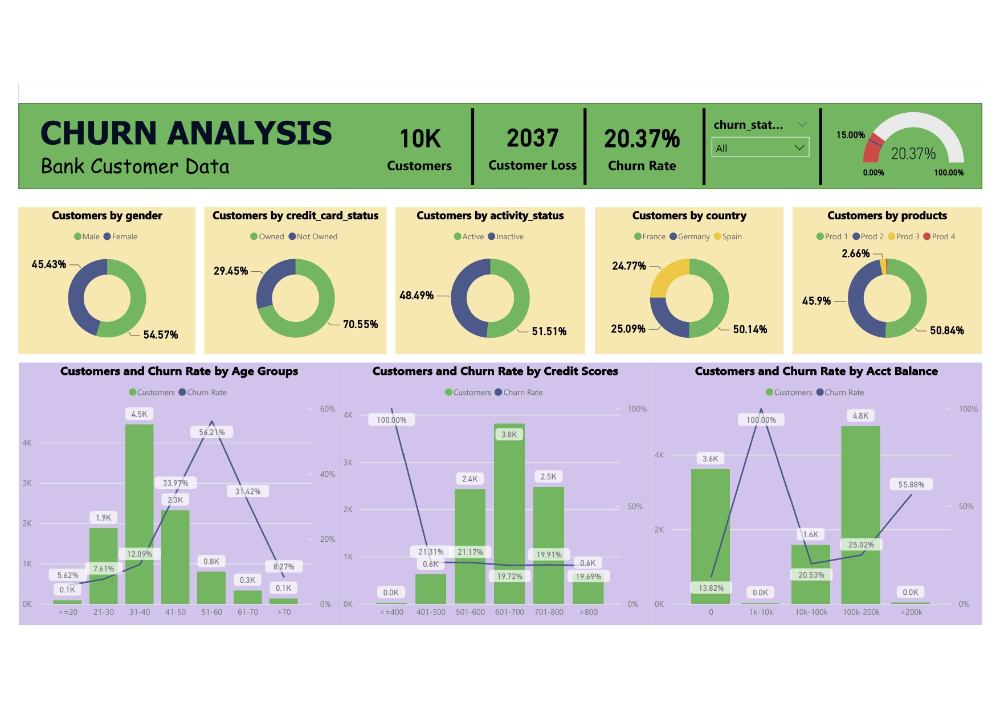

# 💳 Bank Customer Churn Prediction

A comprehensive machine learning solution for predicting customer churn in the banking industry, featuring an interactive web application and business intelligence dashboard.

## 🎯 Project Overview

This project implements an end-to-end customer churn prediction system that helps banks identify customers at risk of leaving. The solution combines advanced machine learning techniques with user-friendly interfaces to provide actionable insights for customer retention strategies.

## ✨ Features

- **Real-time Churn Prediction**: Instant probability scoring (0-100%) for customer churn risk
- **Interactive Web Application**: User-friendly Streamlit interface for easy prediction input
- **Comprehensive Analytics**: Multi-dimensional customer profiling with 11 key features
- **Business Intelligence**: Power BI dashboard for executive-level insights and trend analysis
- **Scalable Architecture**: Production-ready model deployment with pickle serialization

## 🛠️ Technology Stack

- **Machine Learning**: XGBoost, Scikit-learn
- **Web Framework**: Streamlit
- **Data Processing**: NumPy, Pandas
- **Visualization**: Power BI
- **Model Persistence**: Pickle
- **Language**: Python 3.x

## 📊 Model Features

The prediction model analyzes the following customer attributes:

### Demographic Information
- Age
- Gender
- Country (France, Germany, Spain)

### Financial Profile
- Credit Score (300-850)
- Account Balance
- Estimated Salary

### Banking Relationship
- Tenure (Years with Bank)
- Number of Products
- Credit Card Ownership
- Active Member Status

## 🚀 Getting Started

### Prerequisites

```bash
pip install streamlit numpy pickle scikit-learn xgboost
```

### Installation

1. Clone the repository:
```bash
git clone https://github.com/yourusername/customer-churn-prediction.git
cd customer-churn-prediction
```

2. Ensure model files are in the `model/` directory:
```
model/
├── xgb_model.pkl
├── scaler.pkl
└── gender_encoder.pkl
```

3. Run the Streamlit application:
```bash
streamlit run app.py
```

## 💻 Usage

### Web Application

1. **Launch the App**: Run `streamlit run app.py`
2. **Input Customer Data**: Use the interactive controls to enter customer information
3. **Get Prediction**: Click "🔍 Predict Churn" to receive instant results
4. **Interpret Results**: 
   - ✅ Green: Customer unlikely to churn
   - ⚠️ Red: Customer likely to churn
   - Probability percentage provided for both scenarios

### Sample Prediction

```python
# Example customer profile
Customer Profile:
- Credit Score: 650
- Gender: Female
- Age: 35
- Tenure: 5 years
- Balance: $50,000
- Products: 2
- Credit Card: Yes
- Active Member: Yes
- Salary: $100,000
- Country: Germany

Result: ✅ Customer not likely to churn (15% probability)
```

## 📈 Model Performance

- **Algorithm**: XGBoost Classifier
- **Features**: 11 engineered features
- **Preprocessing**: StandardScaler normalization, Label encoding
- **Output**: Binary classification with probability scores

## 🏗️ Project Structure

```
ChurnPrediction/
│
├── app.py                 # Main Streamlit application
├── model/                 # Trained model artifacts
│   ├── xgb_model.pkl     # XGBoost trained model
│   ├── scaler.pkl        # Feature scaler
│   └── gender_encoder.pkl # Gender label encoder
├── README.md             # Project documentation
└── requirements.txt      # Python dependencies
```

## 📊 Business Intelligence Dashboard



The project includes a complementary **Power BI dashboard** providing:

- Customer churn trend analysis
- Risk segment identification
- Retention campaign performance metrics
- Executive-level KPI monitoring
- Interactive filtering and drill-down capabilities

## 🎯 Business Impact

### Key Benefits
- **Proactive Customer Retention**: Identify at-risk customers before they churn
- **Targeted Marketing**: Optimize retention campaigns based on risk scores
- **Cost Reduction**: Reduce customer acquisition costs by preventing churn
- **Data-Driven Decisions**: Leverage predictive analytics for strategic planning

### Use Cases
- Customer relationship management
- Retention campaign targeting
- Risk assessment automation
- Executive reporting and KPIs

## 🔮 Future Enhancements

- [ ] Model retraining pipeline automation
- [ ] A/B testing framework for retention strategies
- [ ] Real-time data integration
- [ ] Mobile application development
- [ ] Advanced feature engineering
- [ ] Model explainability (SHAP values)

## 🤝 Contributing

1. Fork the repository
2. Create a feature branch (`git checkout -b feature/AmazingFeature`)
3. Commit your changes (`git commit -m 'Add some AmazingFeature'`)
4. Push to the branch (`git push origin feature/AmazingFeature`)
5. Open a Pull Request

## 📝 License

This project is licensed under the MIT License - see the [LICENSE](LICENSE) file for details.


## 🙏 Acknowledgments

- Banking industry dataset providers
- Streamlit community for excellent documentation
- XGBoost developers for the powerful ML framework
- Power BI team for business intelligence capabilities

---

⭐ **Star this repository if you find it helpful!**
